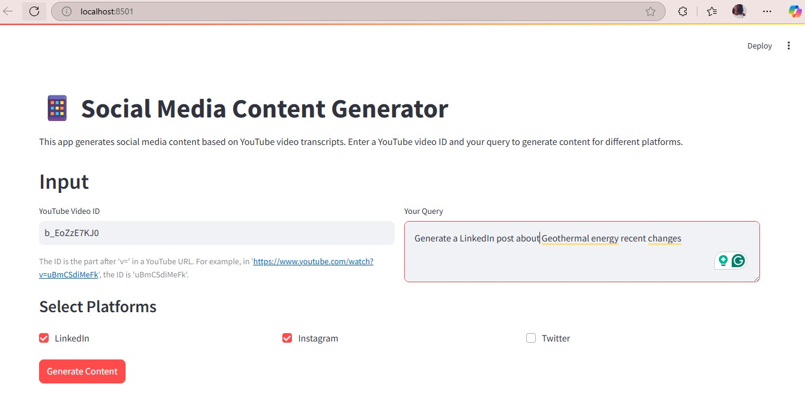

# Social Media Content Generator


A Streamlit web application that generates social media content based on YouTube video transcripts using OpenAI's GPT models.

## Features

- Extract transcripts from YouTube videos using the video ID
- Generate content for multiple social media platforms (LinkedIn, Instagram, Twitter)
- Customize your content generation query
- Download generated content for each platform

## Installation

1. Clone this repository:
   ```
   git clone <repository-url>
   cd social-media-agent
   ```

2. Create a virtual environment and activate it:
   ```
   python -m venv .venv
   source .venv/bin/activate  # On Windows: .venv\Scripts\activate
   ```

3. Install the required dependencies:
   ```
   pip install -r requirements.txt
   ```

4. Create a `.env` file in the root directory with your OpenAI API key:
   ```
   OPENAI_API_KEY=your_openai_api_key_here
   ```

## Usage

1. Run the Streamlit app:
   ```
   streamlit run app.py
   ```

2. Open your web browser and navigate to the URL displayed in the terminal (usually http://localhost:8501)

3. Enter a YouTube video ID (the part after `v=` in a YouTube URL)

4. (Optional) Customize your query or use the default

5. Select the social media platforms you want to generate content for

6. Click "Generate Content" and wait for the results

7. View and download the generated content for each platform

## Running the Script Version

If you prefer to use the script version instead of the web app:

```
python social_media_agent.py
```

This will run the agent with a default video ID and generate content for LinkedIn and Instagram.

## Requirements

- Python 3.8+
- OpenAI API key
- Internet connection for YouTube transcript retrieval and web search

## Dependencies

- openai
- openai-agents
- youtube_transcript_api
- python-dotenv
- streamlit

## License 

Apache-2.0 license
